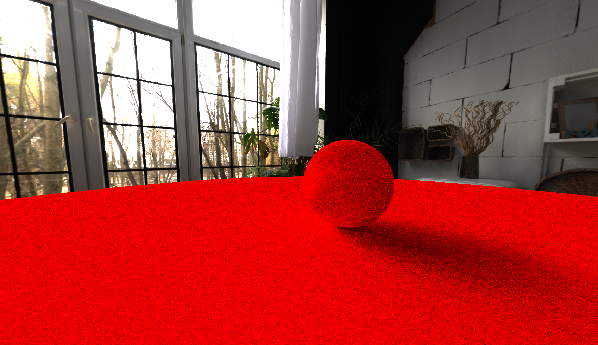

# RayTracer
RayTracer, this project is about me (@CloudCodingSpace), creating a real-time raytracer pretty much from scratch with very less number of dependencies.
The prefferred language of choice is indeed C++. And the graphics API is OpenGL.

## Build
First you need to clone this repository using this command on your terminal or powershell :- 
    

    git clone --recursive https://github.com/CloudCodingSpace/RayTracer

Then simply run these commands on your terminal :-  
    

    mkdir bin
    cd bin  
    cmake ..  
    cmake --build . --parallel

When you are finally done with **building** the project, then find your executable and run it.
When you run the executable, then it will open a window and render the scene in real-time.

## Dependencies
This project uses a couple of dependencies. Namely :- 
- GLM
- TinyOBJLoader
- ImGUI
- GLFW
- GLAD

## Features
 - Can render a hdri panorama/equirectangular image as a skybox
 - Can select the hdri panorama/equirectangular image during runtime
 - Can save the scene as an png image, found at output/img.png that is present in the same folder as the RayTracer executable.
 - Can render multiple spheres
 - Can add spheres during runtime
 - Can add materials during runtime
 - Can change the sphere & material properties during runtime through ImGui
 - Can do some reflection and the number of bounces per ray can be controlled through the ImGui Settings panel
 - The ImGui window can be dragged out of the parent window by the ImGui viewports feature
 - Can serialize and deserialize the scene data in an scene.save file
 - Can select the material type at runtime like Diffuse & Metallic

 ## Screenshots
 
 
 
 